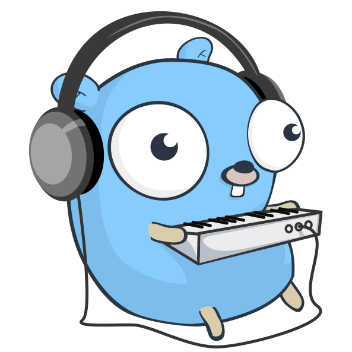

### Hi there 👋

<!--
**double12gzh/double12gzh** is a ✨ _special_ ✨ repository because its `README.md` (this file) appears on your GitHub profile.

Here are some ideas to get you started:

- 🔭 I’m currently working on ...
- 🌱 I’m currently learning ...
- 👯 I’m looking to collaborate on ...
- 🤔 I’m looking for help with ...
- 💬 Ask me about ...

- 😄 Pronouns: ...
- ⚡ Fun fact: ...
-->

- 🔭 I’m currently working on : CloudNative, Cloud
- 🌱 I'm learning ...

  

- 📫 How to reach me: [http://double12.github.io/](https://double12gzh.github.io/) or https://gzh.readthedocs.io/
- ⚡ Personal Pubs: <<OpenStack架构与实践>>
- 🌱 Fun fact: Chinese Chess
